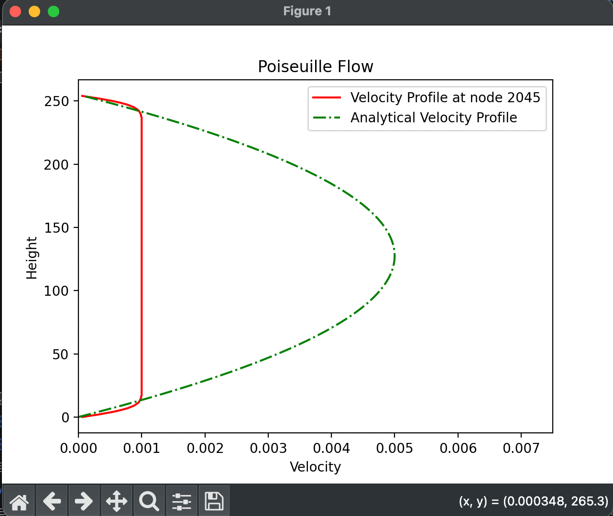

**Goal**: To build a 2D fluid flow simulation using Lattice-Boltzmann Method (LBM) to simulate the flow of fluids of varying densities and speed around different objects.
This is further accelerated using the Python library taichi Lang to implement GPU acceleration.

**Scientific Objective**: "Using LBM simulator to find the effects of varying plaque buildup on cardiovascular diseases in arteries." 

**Technologies**
  * **Python**: Main programming language
  * **Taichi Lang**: Used for Hardware/ GPU acceleration.
  * **Numpy**: Used for Data Handling.
  * **Matplotlib**: Used for data visualization and plots/ graphs.

**Current Progress**
*Status: Debugging*
Currently validating the solver against analytical Poiseuille flow solutions.

**Project Roadmap**
  1. **Phase 1**: Foundations
  2. **Phase 2**: GPU Kernels & Simulation Loop
  3. **Phase 3**: Core Simulation & Objects implementation
  4. **Phase 4**: Poiseuille Flow Validation